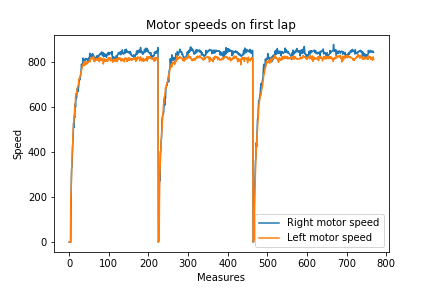
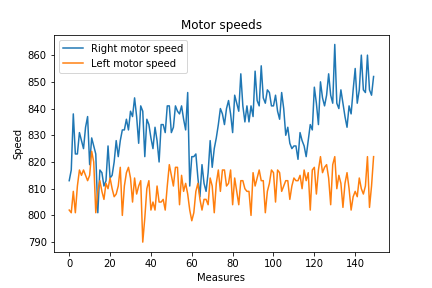
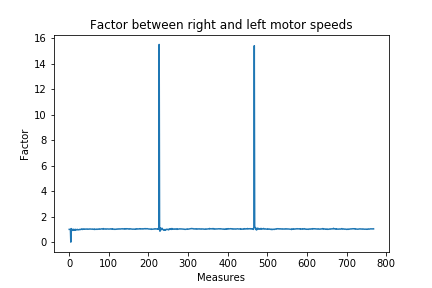
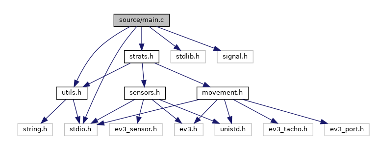

# Welcome to Team 5 OS's project
 
Hello! This repository was made by TEAM 5 in the OS course at EURECOM 2022, and was composed by [@n3k0m4](https://github.com/n3k0m4), [@faroukfaiz10](https://github.com/faroukfaiz10), [@smlmz](https://github.com/smlmz), and was supervised by Mr ludovic Apvrille [@ludovicapvrille](https://github.com/ludovicapvrille).

To help guide you through the sections of this document, please consider looking directly at the generated documentation for all our methods inside [here](html/files.html).
 
## Introduction
 
The Eurecom Kart project consists of building a robot using the EV3 Brick, to play a game where it has to win a race against other teams' robots while throwing and escaping obstacles. The programming side of this project was done thanks to low level techniques acquired during the OS lectures.
 
## Robot build
 
Our initial decision was to try and make the robot in the most minimalist and compact build possible. Even though some fancy and complex builds, with arms and sophisticated add-ons (Lego wheels to the sides to limit the crashes with the walls) are tempting, and could probably be useful to keep the robot from flipping, they create a non-uniform mass distribution and make it very hard to keep a steady, high precision, and fast movement. So this choice was taken to have the minimal components mounted (i.e. optimal mass distribution), which hopefully save us from a lot of troubles.


 
Our build consists of 3 tacho motors, two mounted directly as a base in the lower part, to animate the wheels, and a third to animate the lever and throw obstacles. A sonar was also on the lower part of the robot (mainly for distance measures), and a touch sensor mounted on the front part, to be used to detect when the robot crashes directly into the wall to calibrate and then continue. We also base a big part of our strategy around a gyroscope. The gyroscope is mounted in the back of the robot and will be used to calibrate the movement of the robot, detect if an accident happened, and mainly provide high precision turns.
 
 
## Components and limitations
 
The build is divided into 4 components, apart from the ev3 brick.
 
### Motors
 
The motor section in the ev3 documentation was very detailed, which made writing the section code about the movement an easy and straight forward task. Our architecture used two main tacho motors to move the robot around. In an ideal setting, the motors will be calibrated, and the speed would match between the two motors. Unfortunately, this was not the case with the package we got, so we spent an important part of our project on calibrating the movement.
 
**Calibration:**

To do so, we first put the robot (fully charged) on the track and let it move freely with speed set at maximum speed but keep the logic of the turns and calibration, and gather the speeds from both motors during the whole trials.
 
<p align="center">
  
</p>
 
In the first figure we can see that in the grand scheme of the course, the right motor plot is almost always on top of the left motor one besides a small part when they are in sync. 
 

To be able to notice this difference, we can limit the plot interval (zoom into a small section).

<p align="center">
  
</p>

 
It is, as we noticed in the test, the right motor runs a bit faster than the left one, and the accumulation of the small deviations result in a big difference in the robot movement and behaviour.
 
To solve this issue, we need to find a coefficient that overall calibrates the difference between the two tacho motors. We also use the data from before to plot the graph of the factor `left_motor_speed/right_motor_speed`, to get a sense of the difference between the two motors.

<p align="center">
  
</p>
 
A factor of `value` seems to be constant thought out the movement sections of the robot, we are also aware that these values would be different on other settings of the robot (less speed or more speed, and less charged battery).
 
The differences between the wheels above is maximal because we're using maximum speed. What explains the relatively big factor around 3%-5% is that the right motor can reach higher speeds than the left one. Asking both motors to run at their max speed maximizes the difference between the two. Noticing this gives us the first solution to our problem: Running at a lower speed than the max speed. We noticed that both motors can easily reach a speed of 800 if fully charged. We decided to go for that value for the rest of the tests.

Unfortunately, that was not enough to fix the speed difference between the motors, as there were errors that were accumulating after running them for a relatively longer period of time (>60s). We decided to correct those differences programmatically by making use of the gyroscope and making sure the robot follows a defined angle. We corrected the speeds of the motors with a factor relative to the angle difference. We will dive deeper into this in the implementation section.

To sum it up: To fix the motor's speed difference, two solutions were combined:
- Solution 1: Run at a speed both motors can reach (i.e. 800)
- Solution 2: Programmatically ensure the robot follows the same angle when moving forward.

Finally, the third motor doesn't need any calibration, as its role is to only move down to throw the obstacle and up to avoid obstructing the touch sensor.
 
### Gyroscope
 
The use of the gyroscope is limited to the detection of the angles. We also based the movement correction (keep a straight line movement) with the use of the original angle to keep in case of any accident with other robots.

Since the gyroscope plays an important role (Probably second only to motors), as it intervened in correcting the motor's speed difference, making turns and recovering from accidents to name a few, it's no surprise that we required its value to be as accurate as possible. 
 
**Calibration:**

There are 2 main issues when it comes to the gyroscope: Drift and lag.

- Drift: Drift is when the values of the gyro change while it's still (i.e. not turning). We noticed that this problem showed up after a number of laps/turns. Inside the sensor section in the ev3 block there is a mode for the gyroscope called `GYRO_CAL_MODE`, this mode is used to stabilize the values of the sensor once switched on. Setting the gyro mode to `GYRO_CAL_MODE` and back to `GYRO_ANG_MODE` after a small wait fixes this issue.
- Lag: We didn't have that big of an issue when it came to lag, as we weren't turning at a big rate. However we still decided to handle it to reduce potential errors down the line. To fix this issue, we reduced our motors speed when turning as we got closer to the desired angle, this made sure that the angle rate is not important once we're close to stopping. We noticed that our robot rotation got much more accurate after this, especially on the long term (i.e. after many turns).
 

 
### Sonar
 
The sonar implementation was not a difficult part, as our goal was to keep looking in a direct line (No shapes detection) and measure the distance to the next obstacle (walls included).
 
**Calibration:**
 
One big issue we faced with the sonar values was that the buffers we get for the sensor getting moving values (big oscillation in the values) and not being able to update correctly. To remediate this issue, we implemented `get_stable_sonar_value` in `sensors.c`, that when detecting many noise in the values, it stops and loops until it's able to get two consecutive values with a maximum threshold of 2 cm difference. See [code](https://github.com/n3k0m4/RobotOs/tree/website#calibrating-sonar)

### Touch sensor

The touch sensor is the only sensor that is analog and provides correct values. Its job is to detect when the robot in pushing a wall so we can recalibrate and continue the course. No calibration was needed for this sensor.

## Implementation

The implementation of all the robot's logic is wrapped around the ev3dev library. We have decided not to complicate our code for the readers and write the necessary wrappers around the native method of `ev3dev-c`. This wrapper methods and the modular architecture (next section) make it easy for anyone to follow the code and understand the use of each method.

We have also implemented a specific documentation for all the sections of our project's code using `doxygen`. Please also consider opening the documentation [here](html/files.html) to get more insights on the methods and their parameters.

### Architecture and tree

Our idea starting this project was to make a modular type architecture (usual for C projects), where we have our source code (our modules) in the `source` directory, an `include` directory (contains the headers of the modules; equivalent of interfaces), a `build` directory to put the compiled `.o` files before linking them, and a `libraries` directory when we put the necessary `.a` files to statically link them in our `main` binary.    

Inside `ev3dev-c` we have our submodule that we build our project with. The project's tree looks like the following:
```
.
├── build
│   ├── main.o
│   ├── movement.o
│   ├── sensors.o
│   └── strats.o
├── ev3dev-c  [20 entries exceeds filelimit, not opening dir]
├── include
│   ├── logger.h
│   ├── movement.h
│   ├── sensors.h
│   ├── strats.h
│   └── utils.h
├── libraries
│   └── libev3dev-c.a
├── Makefile
├── README.md
└── source
    ├── main.c
    ├── movement.c
    ├── sensors.c
    └── strats.c

```
For mode details on how to compile the code look [here](https://github.com/n4k0m4/RobotOs/tree/main#welcome-to-team-5-oss-project).

The dependency graph for our modules is the following: `main.c` being our program's entry point. 
<p align="center">
  
</p>

### Movement and Sensors

In this section we go a bit in the details of the methods and the logic implemented in the `sensors` and `movement`.

#### Movement

This module exports the declared methods to other files that includes it (mainly `strats.h`). In this module, we define first the `PORTS` global constants to show which motor is linked to which output in the ev3 brick (useful is case we want to swipe cables), we also define the `THRESHOLD` global constants useful for the robot login anc behavior.

The methods in the `movement.c` are mainly wrappers around ev3dev kit, so we won't show any details on them in this section, you can find the code [here](https://github.com/n3k0m4/RobotOs). 

The two interesting methods are `move_keeping_angle` and `turn_to_angle`, as they use some calibration to keep a good movement.

```C
void move_keeping_angle(int angle, int speed)
{
    int current_angle;
	get_gyro_value(&current_angle);
	int deviation = MODULO(current_angle - angle_to_keep, 360);
	double factor = (double)abs(180 - deviation) / 180;
	int reduced_speed = _validate_speed(speed * factor);
	if (deviation < 180)
	{
		// Deviate left
		_run_motor_forever(sn_motor_right, speed);
		_run_motor_forever(sn_motor_left, reduced_speed);
	}
	else
	{
		// Deviate right
		_run_motor_forever(sn_motor_right, reduced_speed);
		_run_motor_forever(sn_motor_left, speed);
	}
}

void turn_to_angle(int destination_angle, int thres)
{
    stop(TACHO_COAST);
    int current_angle;
    get_gyro_value(&current_angle);
    int angle_to_turn = (destination_angle - current_angle) % 360;
    uint8_t sn_motor = angle_to_turn >= 0 ? sn_motor_left : sn_motor_right;
    uint8_t sn_other_motor = sn_motor == sn_motor_right ? sn_motor_left : sn_motor_right;
    int speed = max_speed;
    // Run motors at inverse speeds for the robot to turn around itself
    _run_motor_forever(sn_motor, speed);
    _run_motor_forever(sn_other_motor, -speed);
    while (abs(angle_to_turn) > thres)
    {
        get_gyro_value(&current_angle);
        angle_to_turn = (destination_angle - current_angle) % 360;
        // Decrease speed as the angle gets closer to destination to 
        // improve accuracy and limit lag effect.
        speed = (int)(max_speed * ((float)abs(angle_to_turn) / 180));
        _run_motor_forever(sn_motor, speed);
        _run_motor_forever(sn_other_motor, -speed);
    }
    stop(TACHO_HOLD);
}
```


### Calibration methods

#### Calibrating Sonar
``` C
int get_stable_sonar_value(int *value_buf){
    int previous_sonar_value;
    get_sonar_value(&previous_sonar_value);
    const int ERROR_THRESHOLD = 20; // 2cm
    int sonar_value;
    int nb_constant_measures = 0;
    // Stop when we have 2 consecutive close values.
    while (nb_constant_measures < 2){ 
        SLEEP(500);
        get_sonar_value(&sonar_value);
        if (abs(previous_sonar_value - sonar_value) < ERROR_THRESHOLD) nb_constant_measures++;
        else nb_constant_measures = 0;
        previous_sonar_value = sonar_value;
    }
    *value_buf = sonar_value;
}
```


#### Calibrating gyroscope
``` C
void calibrate_gyro(){
    set_sensor_mode(sn_gyro, GYRO_CAL_MODE);
    SLEEP(1000);
    set_sensor_mode(sn_gyro, GYRO_ANG_MODE);
    SLEEP(500);
}
```
## Strategies

This year's project was divided into two main parts. A first one, in the form of a course against time, where we put the robot in the track and it should be able to do 5 turns while avoiding obstacles. The second part was in the form of a course against other robots, where throwing obstacles is allowed.

### Against time

The particularity of this test is not how fast can the robot run, but it is in the capability of the robot to calibrate itself during the course. In our first tests, without anyone calibration, the robot wasn't able to move past the mark at the half section (half tour). This bahavior was mainly due to the accumulation of small errors from both the sonar and the gyroscope.

To correct these issues we decided to enforce a calibration mechanism based on the number of turns the robot made. The idea behind this method is to give the robot the freedom to move in even number of turns and only decide to turn when the sonar value is less than a threshold, but in the odd turns we let the robot go directly into the wall to calibrate, and obviously when the robot is at 90 degrees from the wall the touch sensor is pushed, which signals the robot to move backwards and turn to the left to continue to the course. 

After implementing this method we were able to go from a 25% success rate to over 90% (in making 5 turns). This was mainly due to the small hard limit on the deviation the robot could accumulate over the race, because after 2 turns we are sure to start the movement parralel to the wall.

It is also worth mentioning that the way we escape the fixed obstacles in the track is by calculating the right distance to fall back when we are calibrating with the wall.

```C
void against_time()
{
    const int SPEED = 800; // DO NOT SET TO 0
    const int SONAR_THRESHOLD = 20 * 10;
    int nb_turns = 0;
    int sonar_value;
    int current_angle; // TODO: Remove useless var
    get_gyro_value(&current_angle);
    int angle_to_keep = current_angle;
    while (true)
    {
        get_sonar_value(&sonar_value);
        move_keeping_angle(angle_to_keep, SPEED);
        if (nb_turns % 2 == 0)
        {
            if (sonar_value < SONAR_THRESHOLD)
            {
                stop(TACHO_HOLD);
                get_stable_sonar_value(&sonar_value);
                if (sonar_value < SONAR_THRESHOLD)
                {
                    angle_to_keep -= 90;
                    turn_to_angle(angle_to_keep, 5);
                    nb_turns++;
                }
            }
        }
        else
        {
            // TODO: Have get_stable_sonar_value logic here too
            if (!check_pressed())
                continue;
            SLEEP(200);
            recover();
            SLEEP(200);

            calibrate_gyro();
            get_gyro_value(&current_angle);
            angle_to_keep = current_angle;
            nb_turns++;
        }
    }
}
```

The calibration methods `get_stable_sonar_value`, `calibrate_gyro`, and `move_keeping_angle` help enforcing the calibration by getting more accurate and stable values from the sensors and also by keeping the robot in a straight line.

### Against cars

TL;DR: `against_cars = against_time + obstacle avoiding logic`
  

Although simplistic, the expression above sums up nicely the logic of the `against_cars` startegy. Indeed, the `against_time` strategy has all the logic needed to do the laps, calibration ...etc. It'd be a shame to waste it. Especially since the only difference is that we might have more obstacles down the road than the built-in ones. So we decided to add a function to avoid obstacles by going around them.


This begs the question: How to differentiate between an obstacle and a wall. For that we have implemented `_is_obstacle_in_turn` that decides, depending on the current turn number (i.e the number of times we got to a wall and turned => 4 turns in a lap) and the distance we did since the last turn. If the obstacle we find is not expected so soon (i.e. before the motor have turned "enough" since last turn), we assume it's not a wall and try to bypass it.

To bypass the obstacle, we basically look left and right, we chose the direction with the most space and we look for bypassing the obstacle from that side. On top of that are a number of checks to not stumble against a new obstacle and to make sure the robot avoids the obstacle by a sufficient distance.

## Steps and Tests

To get to final prototype of both the code and the sensors' logic, we had to undergo many testing phases. The first phases were about the decision making on what sensors can we use and what would be the purpose of each element in the architecture. Once we have set the map for the components to use, we had to solve a diffcult part abour calibrating the sensors and calibrating the movement in the track. The last phase of our approach was about detecting (differentiating) the obstacles and how can we work our way around them to continue the course.

### Phase 1 (Components' choice):

The decision making on which sensors to use was not difficult to conclude as the number of possibilities is limited. 

First, we started by basing our robot on just the gyroscope and sonar. This approach came to a halt fast because due to the noisy values of both the gyroscope and the sonar, so we couldn't neither keep the robot in a precise direction nor make it take the right turns to continue the course.

At this step we already knew that there must be a calibration mechanism using another sensor. So, we have included the use of the touch sensor. The robot started behaving better specially when it goes directly into the wall, it detects that it arrived so it goes back and turn. This version was the one we used in the first test (13th Jan) and we were able to validate the 5 turns but with not so reliable results.

### Phase 2 (Stability & Reliability):

Throught this phase our focus was on getting the sensors and the tacho motors to behave in a precise way as they were both accumulating and making the runs not reliable (more than 50% of the runs didn't finish the 5 turns). 

For the motors, we have decided to not alwyas go full speed as the motors don't ramp up to their max_speed in the same time, which created an angular differnce right on the start of the robot. After some investigations, data gathering and plotting we found out that both motors get to 800 as speed relatively at the same time, with the difference a factor we were able to find. More details on this [here](###Motors%20and%20calibration)


The sensors unfortunely couldn't be tuned that easily. So, we had to handle that part in the software, where we implemented util functions that swipes between modes for the gyroscore to calibrate it before any major movement. The same method was used for the sonar, as we had a similar behavior were the values were too noisy to make a decision. To solve this issue we force the robot to brake and read values until they stabilize within a threshold then continue. More details on the code [here](###Gyroscope%20and%20calibration) and [here](###Sonar%20and%20calibration)

As results of all these tweeks our robot is much more reliable and can run the 5 turns almost always without hitting any fixed obstacle or getting of track (deviations). 

### Phase 3 (Always Be Escaping):

At this step our robot was reliable in its movements and able to detect relatively correct values with its sensors, so we started the phase of trying to compete against other robots and try to escape them and their obstacles.

This has been by far the hardest part seeing how broad it is. We settled on defining an obstacle as anything in front of the robot that is not a wall. This can include other robots, the obstacles they throw, the obstacles we throw or even the obstacles built into the stadium. It's important to notice that the robot does not distinguish between the obstacles and treat them all equally by trying to get around them.

This was the last piece of the puzzle for our robot. Equipped with this logic, it's now ready to go toe to toe against other robots !

